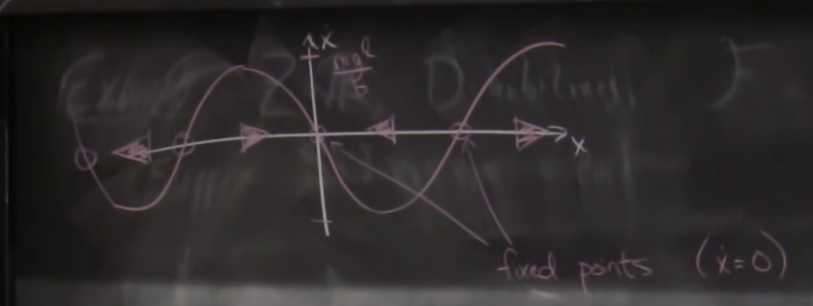

# Graphical analysis & Goal Build intuition

> 书 nonlinear Dynamics and chaos - steven H strongatz
> notes: http://underactuated.csail.mit.edu/pend.html 被拆成了2-6课

1. 这一部分主要讲的是如何将动力系统用矩阵微分方程 q q‘ q'' u t 来表示， 
其中 q 是设置向量  q’ 是速度 q'' 是加速度 u 是控制向量 u' 
这种系统也有时变的版本，用这种方式表示主要是为了方便得出 u 和 u'， q 和 q‘之间的关系

当方程中没有不清楚的量时为线性系统时，结果可以直接接出

2. 稳定就是一阶倒数为0时 
局部稳定指在一定范围内运动不会超出范围
局部吸引指在一定范围中 随着时间逐步被吸引上一点（这里可以玩notbook中的例子）
指数局部稳，指指数时间内局部稳定
重点在于分析 u 和稳定情况间的关系，采取何种u’ 可以让 q‘ q''稳定

## simple Pendulum 悬垂钟摆

T = 1/2 * m * L ^ 2 * theta ^ 2 

u = - m * g * l * cos(theta)

L = T - u

Q = m * l^2 * theta'' + m * g * l * sin(theta) = - b * theta' + u

Given Theta(0) , Theta'(0)

solve Theta(t)

what happen as t -> infinite

1. linearization 
2. Graphical analysis

Even simpler:

u = 0,  b large 

m * l^2 * theta  is k * g * m^2 / s^2

b * theta' >> m * l^2 * theta''

"dimensional analysis"

b k * g * m^2 / s  

b * sqrt(l/g) >> m * l^2

m * l^2 * theta'' + b * theta' simi= b * theta' + m* g *l * sin(theta) = 0

b * x' + m * g * l * sinx = 0

24:00 有图解

region of attraction / sepratrix 

Autapse (shallow neural network)

## 活着的神经元

The Autapse: a simple illustration of short-term analog memory storage by tuned synaptic feedback

神经元和记忆的关系 

记忆门：x' = -x + tanh(w * x + u) 的图形

忘记门：x' = (f-1) * x + tanh(w * x + u)

## Tracking fixed points "biforcation analysis"

x = [theta, theta']

x' = f(x) = [theta', theta'']

这里有微分方程的图形

homo clinc orbit

稳态

marginally stable: stable in the sense of lyapunov (i, s, l) 

A fixed pt x^asterik is stable in the sense of lyapunov (i, s, l) 

if for any e > 0  has a ro > 0 s.t || x(0) - x^asterik  ||^2 < ro 

then has t > 0 || x(t) - x^asterik  ||^2 < e

Asymptotically stable if || x(0) - x^asterik  || < e

lim t-> inf ||  x(t) - x^asterik  || = 0

Exponential Stability  ||  x(t) - x^asterik  || <= C * e^( - u * t) ,  C > 0

