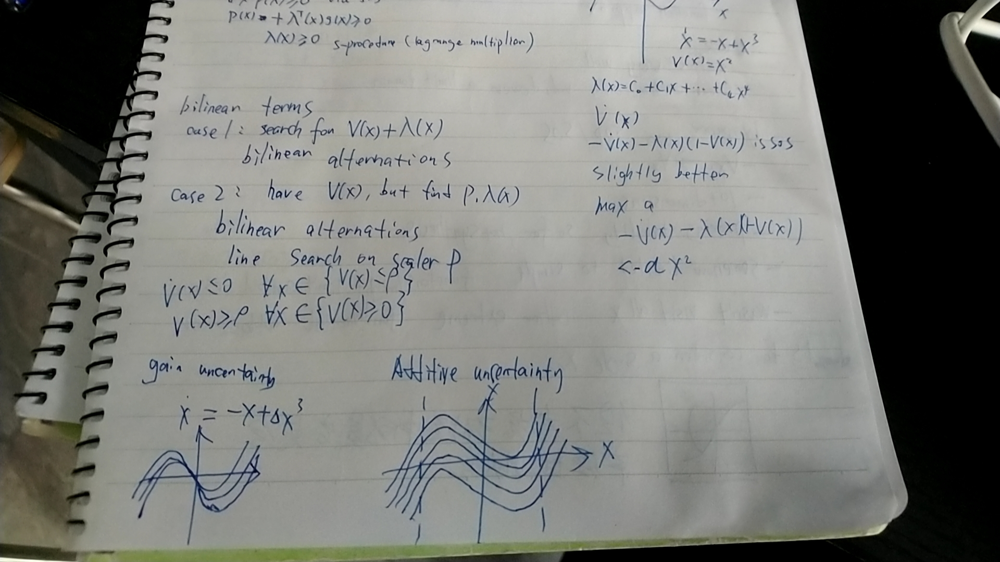
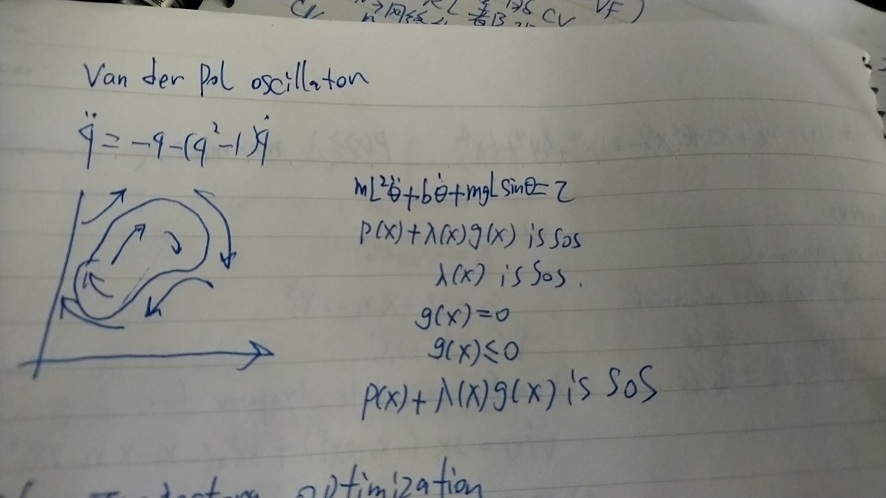

# Computing lyapunov functions of sum of square

## rew 

x' = f(x), V(x) = Sum[a_i *VF_i(x)]

find a : s.t x neq 0 V(0) = 0

V'(0) < 0, V'(0) = 0

V(x) = m^T(x) * P * m (x)

x' = f(x)

V'(x) = m^T(x) * P * (dm/dxf(x)+ ... ) = m^T(x) * Q * m(x)

P * A + A^T * P = Q

Q < 0 

Q11 = P^T a11 + ...

min c^T * a 

P_a(x) is sum of square optimization 

P(x) = a1 + a2*x + ... + ak*x^k

两种解法：

1. 采样法： 从 x_i 的有限集中采样V(xi) > 0 转化为线性优化问题 （性能不好）

2. 凸优化： x' = A * x, V(x) = x^T * P * x, f(x) = x^T * P *A * x + x^T * A^T * P * x = x^T * (P*A + A^T*P) * x, P > 0 , P * A + A^T*p < 0

例1：

2 - 4 * x + 5 * x^2 = [1, x]^T * Q * [1, x]

Q^T = Q > 0 

Q11 = 2, Q22 = 5

Q12 + Q21 = -4

例2: 

P(x) = 4x^2 + xy - 4y^2 - 21x^4 + 4y^4 + 1/3*x^4

P(x) > egin maximize egin

x' = P(x)

V(x) is polynomial, V'(x) = d(V^T)P(x) / d(x) is also polynomial 

find a s.t V(x) 和 V'(x) 都是最小二乘和

例如： 

x1' = - x1 - 2 x2^2

x2' = -x2 - x1 * x2 - 2 X2^3

V(x) = x1^2 + 2 * x2^2

1. verify condidate lyapunov func V'(x) = 2x1( - x1 - 2 x2^2) + 4x2( -x2 - x1 * x2 - 2 X2^3) 偏微分法
2. 把 V 当作多项式 直接搜索 c

## region of attraction analysis

P(x) >= 0, x in { g(x) <= 0 }, x in P(x) >= 0 via SOS

P(x) + eign^T * g(x) >= 0 , eign(x) >= 0 ( S - procedure 拉格朗日乘子 ）

例：

x' = -x + x^3

V(x) = x^2

egin(x) = C0 + c1*x + ... c4* x^ 4 

-V'(x) - egin(x)(1- V(x)) is SOS

slightly better 

max a : -V'(x) - egin(x)(1- V(x)) < -a x^2 

点集强健回归

## bilinear term 

