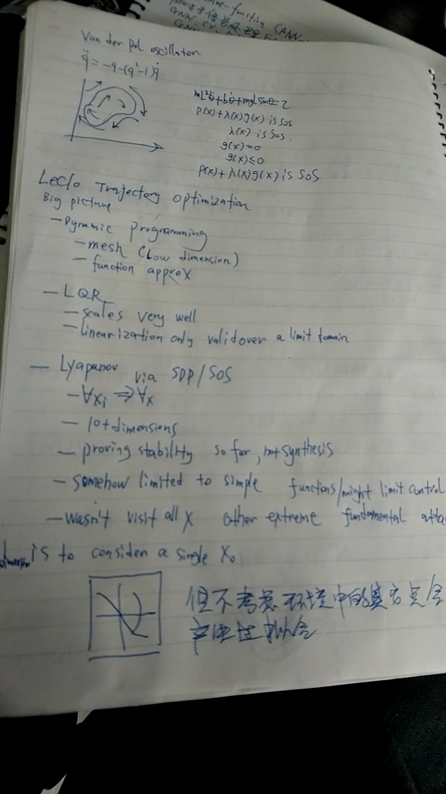
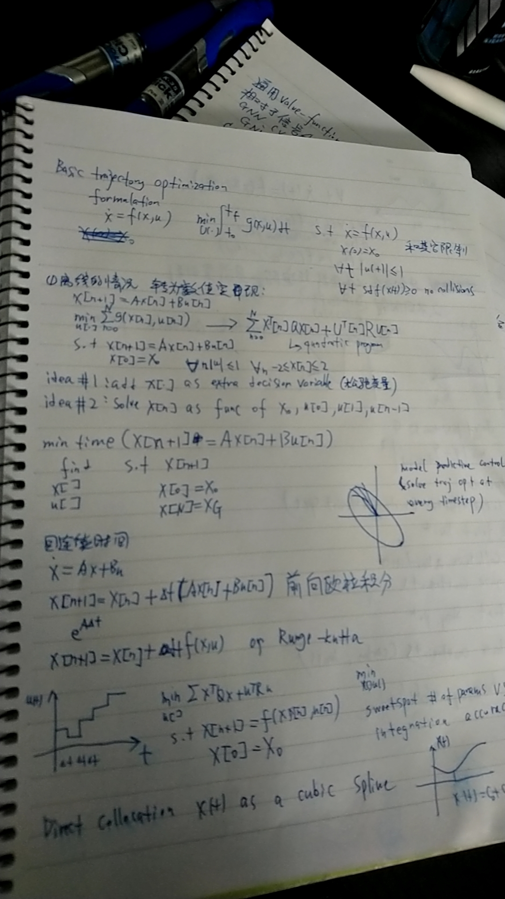
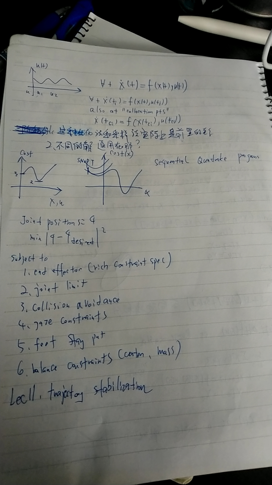

# trajectory optimization

> http://underactuated.csail.mit.edu/trajopt.html

## big picture

## basic trajectory optimization

1. add x[] as extra decisiton variable 松弛变量
2. solve x[n] as func of x0, u[0], u[1], u[n-1]

## 通用形式

