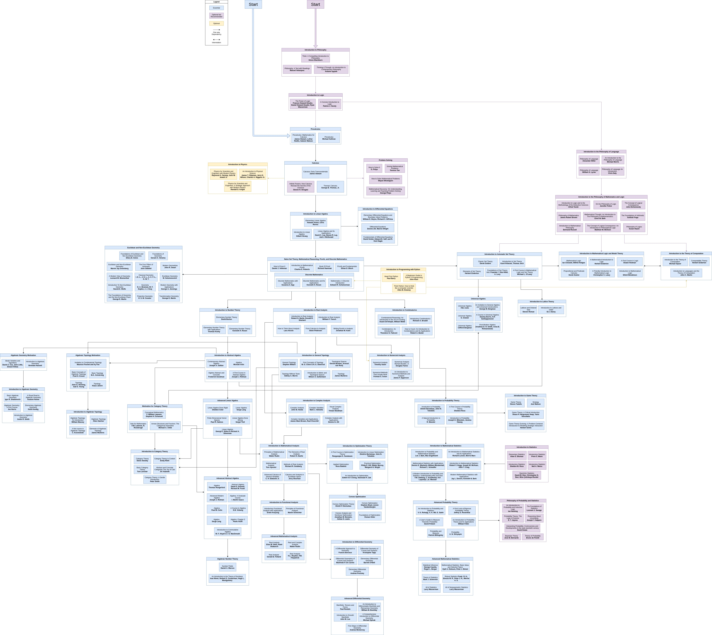

# 学习路径

## mathmatic

1. liner algebra 
2. probility theory 
3. optimize 
4. abstract algebra
5. topology
6. algebra toplogy
7. convex optimize
9. non-linear systems 入门在在微分方程 / 后面一部分在非线性控制中

## 因为数学实在太过无聊，可以结合以下

通识：计算机原理 / 信号系统 / 信息论 

1. 强化学习（动态规划，非线性控制，拓扑采样）
2. cv 3d cv（复分析，优化）
3. 密码学 （代数拓扑）
4. 虚拟化 （拓扑学，抽象代数）

